# City-Scale Retrofitting Analysis for Ahmedabad

## Research Internship
**Intern:** Gullapalli Kavya Durga Sri

**Organization:** SWA Consultancy

**Duration:** May 14, 2026 – July 18, 2026

---

# Project Overview

Buildings account for a significant share of global energy consumption and greenhouse gas emissions. Improving the energy performance of existing buildings through **energy retrofitting** is one of the most effective strategies for reducing urban energy demand and operational carbon emissions.

This internship focuses on preparing **CityBES-compatible Urban Building Energy Modeling (UBEM)** datasets for Ahmedabad. The prepared datasets will later be used to perform **baseline energy simulations**, evaluate **Energy Conservation Measures (ECMs)**, and estimate potential **energy savings** and **carbon emission reductions** for residential buildings.

---

# Understanding Building Energy Retrofitting

## Building Energy Fundamentals

Before beginning the practical implementation, the initial phase of the internship focused on understanding the theoretical principles of building energy systems, energy-efficient design, and urban retrofitting.

These concepts provided the engineering foundation required for preparing Urban Building Energy Modeling (UBEM) datasets and performing city-scale building energy simulations.

The following topics were studied.

---

## Building Energy Consumption

Buildings consume energy primarily for:

- Space cooling
- Space heating
- Lighting
- Ventilation
- Domestic hot water
- Internal electrical equipment

Understanding how each component contributes to total building energy consumption is essential before evaluating retrofit strategies.

---

## Thermal Comfort

Thermal comfort refers to maintaining indoor environmental conditions that are comfortable for occupants while minimizing energy consumption.

The major factors influencing thermal comfort include:

- Air temperature
- Relative humidity
- Solar radiation
- Air movement
- Building envelope characteristics

---

## Building Envelope

The building envelope forms the physical boundary between the indoor and outdoor environments.

It consists of:

- Walls
- Roof
- Windows
- Doors
- Floors

The envelope governs heat transfer and therefore has a major impact on annual building energy consumption.

---

## Heat Transfer Mechanisms

Three primary modes of heat transfer were studied:

- Conduction
- Convection
- Radiation

These mechanisms determine how heat enters and leaves a building and directly influence cooling and heating loads.

---

## Building Insulation

Thermal insulation reduces unwanted heat transfer through the building envelope.

Common insulation materials include:

- Glass Wool
- Rock Wool
- Expanded Polystyrene (EPS)
- Extruded Polystyrene (XPS)
- Polyurethane Foam

Proper insulation improves thermal performance and significantly reduces cooling energy demand.

---

## Building Energy Retrofitting

Building retrofitting involves upgrading existing buildings to improve their energy performance without complete reconstruction.

Typical retrofit measures include:

- Roof insulation
- Wall insulation
- High-performance glazing
- LED lighting systems
- High-efficiency HVAC systems
- Improved building envelope
- Renewable energy integration

These interventions reduce operational energy consumption, electricity demand, and greenhouse gas emissions while improving occupant comfort.

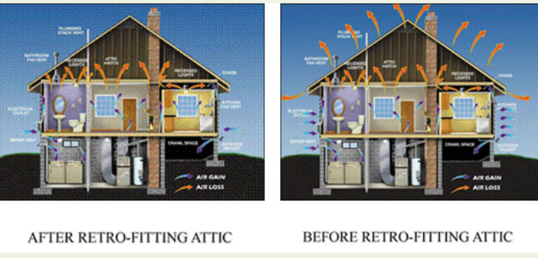

The figure above illustrates the transformation of a conventional building into an energy-efficient building after implementing retrofit measures.

---

## Urban Building Energy Modeling (UBEM)

Urban Building Energy Modeling (UBEM) extends traditional building energy simulation from an individual building to an entire neighborhood, district, or city.

Instead of analysing one building at a time, UBEM evaluates hundreds or even thousands of buildings simultaneously using GIS datasets, weather information, and building characteristics.

This enables planners to estimate:

- Annual energy consumption
- Peak electricity demand
- Carbon emissions
- City-scale retrofit potential

---

## Building Energy Benchmarking

Building energy benchmarking compares the energy performance of buildings against reference or benchmark values.

One of the most widely used performance indicators is the **Energy Performance Index (EPI)**.

\[
\textbf{EPI}=\frac{\text{Annual Energy Consumption}}{\text{Gross Floor Area}}
\]

Benchmarking helps identify inefficient buildings and estimate achievable energy savings through retrofitting.

---

## Energy Performance Indicators

Several building performance indicators were studied before working with CityBES.

These include:

- Site Energy Use Intensity (Site EUI)
- Source Energy Use Intensity (Source EUI)
- Electricity Use Intensity
- Peak Electricity Load Intensity
- Cooling Electricity Use Intensity
- Heating Energy Intensity
- Internal Lighting Energy Intensity
- Internal Equipment Energy Intensity
- Operational Greenhouse Gas (GHG) Intensity

These indicators later become the primary outputs generated by CityBES simulations.

---

## Weather Data in Building Simulation

Outdoor weather conditions strongly influence building energy performance.

Typical Meteorological Year (TMY) weather datasets contain:

- Dry-bulb temperature
- Relative humidity
- Solar radiation
- Wind speed
- Wind direction

These parameters are later used by CityBES to perform annual building energy simulations for every building in the study area.

---

## Why this theoretical study?

Understanding these concepts was essential before preparing GIS datasets because CityBES requires both:

- **Geometric information** such as building footprints, height, number of stories, floor area, and location.
- **Engineering information** such as weather data, building archetypes, and energy benchmark parameters.

Combining these datasets enables CityBES to generate realistic baseline energy simulations and evaluate potential retrofit strategies for urban buildings.

---

# Understanding CityBES

The next stage was understanding **CityBES (City Building Energy Saver)**, an Urban Building Energy Modeling platform developed by Lawrence Berkeley National Laboratory (LBNL).

CityBES converts GIS datasets into city-scale building energy simulation models. It enables planners and researchers to estimate:

- Baseline Energy Consumption
- Building Energy Use Intensity (EUI)
- Peak Electricity Demand
- Operational Carbon Emissions
- Retrofit Savings
- Building-Level Energy Performance

---

## Exploring CityBES Features

### 1. Building Visualization

CityBES visualizes buildings using different energy performance indicators such as Site Energy Use Intensity, Electricity Use Intensity, Peak Electricity Load, Operational GHG Emissions, and many other building-level metrics.

---

### 2. Baseline Energy Simulation

Before applying retrofit measures, CityBES performs **Baseline Energy Simulation**, which estimates the current energy performance of buildings using building geometry, weather data, and benchmark parameters.

---

### 3. Simulation Results

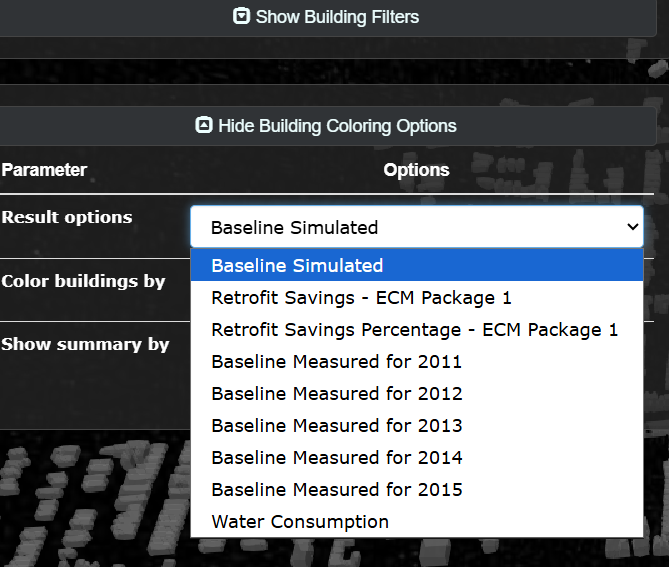

CityBES provides interactive visualization of simulation outputs including energy intensity, electricity demand, carbon emissions, and district-level energy summaries.

---

# Exploring Data Sources

Preparing a CityBES dataset requires multiple GIS and remote sensing data sources.

Several publicly available platforms were explored to understand their available datasets and applicability for Ahmedabad.

---

## VEDAS (ISRO)

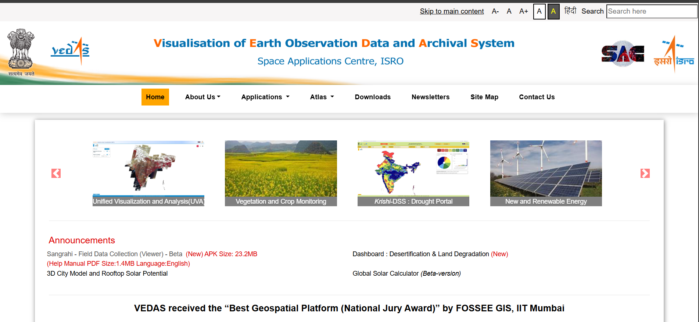

VEDAS provides Indian geospatial datasets and satellite products. It was explored for urban datasets and Ahmedabad building information.

---

## Bhuvan (NRSC)

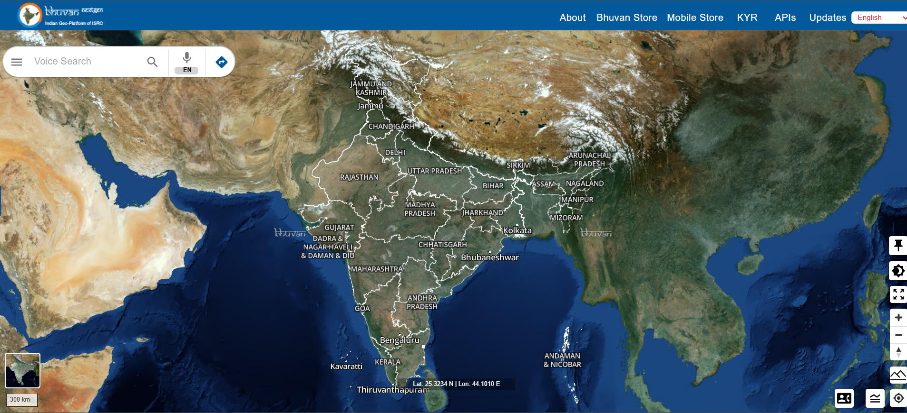

Bhuvan was explored to obtain satellite imagery and urban information for Ahmedabad.

---

## Copernicus Browser

Copernicus Browser was explored for Sentinel satellite imagery and land surface information.

---

## Google Earth Pro

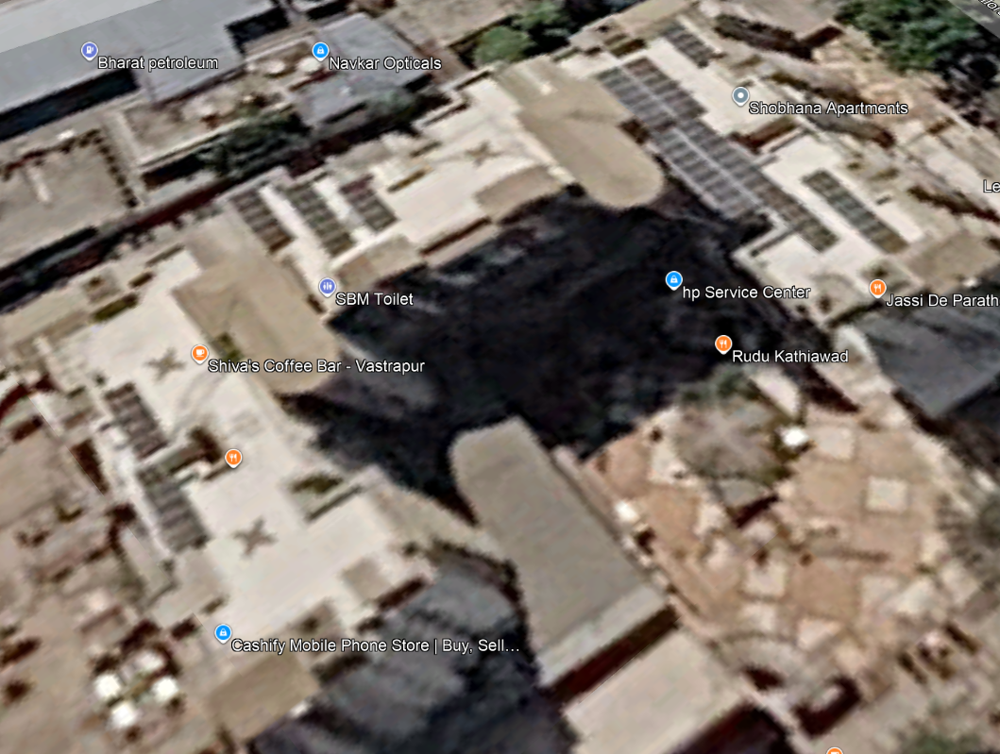

Google Earth Pro was used for visual verification of buildings and manual estimation of building heights wherever required.

---

# Selecting GIS Data Source

Although several remote sensing platforms were explored, OpenStreetMap (OSM) provided the most complete and easily accessible building footprint data suitable for CityBES dataset preparation.

Therefore, OpenStreetMap was selected as the primary GIS data source.

---

# 4. Importing Building Footprints using QuickOSM

The QuickOSM plugin in QGIS was used to directly import OpenStreetMap building footprints for different regions of Ahmedabad.

The following locations were explored:

- Navrangpura
- Thaltej
- Chandkheda
- Vastrapur
- Naroda
- Bopal

---

# 5. Extracting Residential Buildings

Initially, all building footprints were imported from OpenStreetMap.

### Example – Chandkheda (All Buildings)

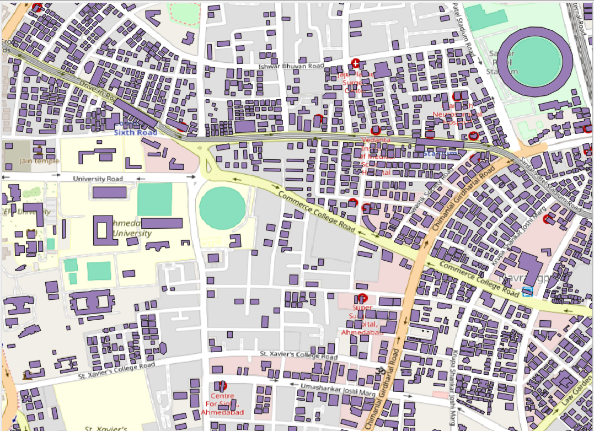

The buildings were then filtered using OpenStreetMap building tags to retain only residential buildings.

### Residential Buildings

#### Navrangpura

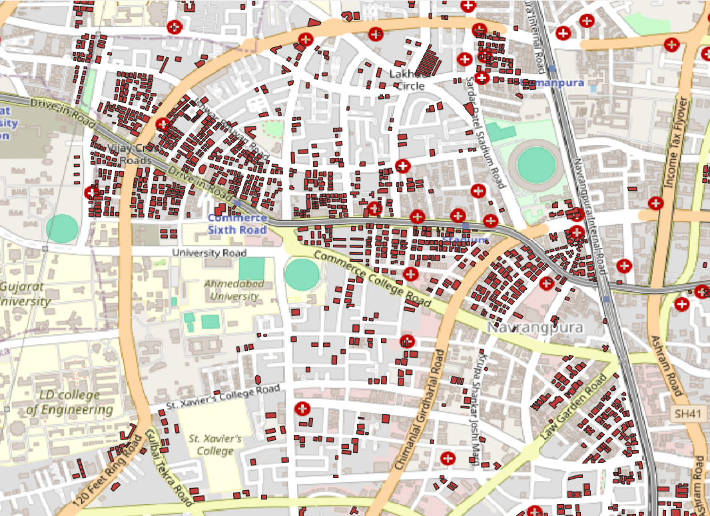

#### Vastrapur

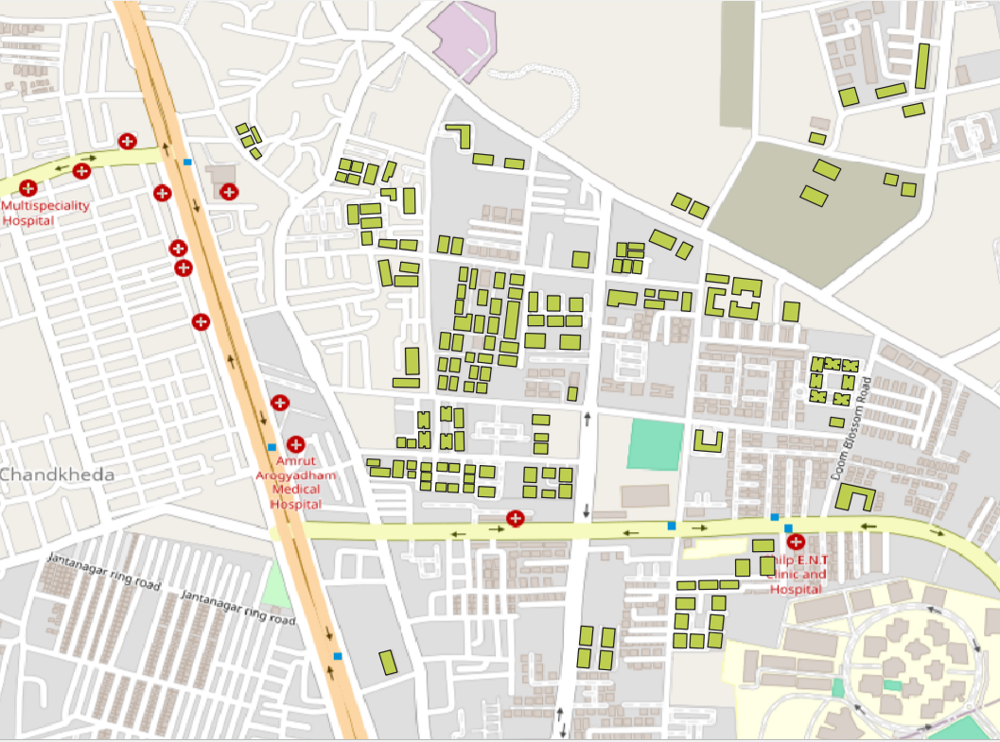

#### Chandkheda

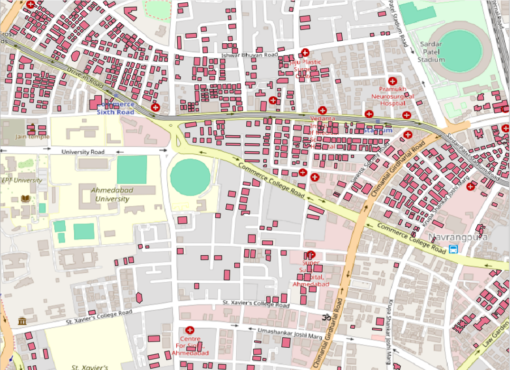

The same workflow was repeated for all study locations.

---

# 6. Preparing Building Attributes

After obtaining residential building footprints, additional attributes required for CityBES were prepared.

The attribute table was enriched with:

- Building Footprint Area
- Latitude
- Longitude
- Building Height
- Number of Stories
- Building Construction Year
- Total Floor Area
- Building IDs

Example attribute tables:

 

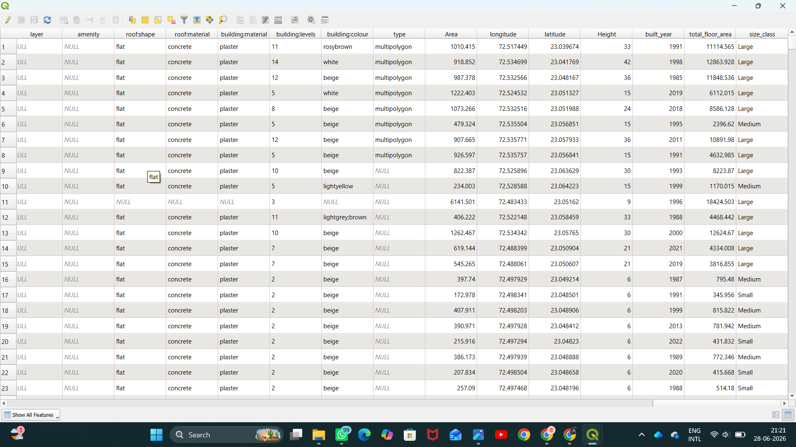

Random construction years were assigned within realistic ranges where public records were unavailable to support prototype building assignment in CityBES.

---

# 7. Challenge: Missing Building Level Data

A major challenge encountered during dataset preparation was the absence of **building level (number of stories)** information in some regions.

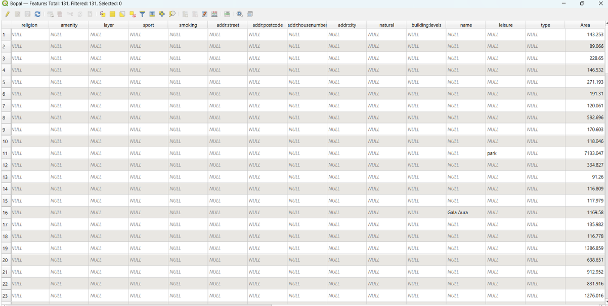

Without building levels, building heights required for energy simulation could not be calculated directly.

---

# Exploring Ahmedabad 3D City Model

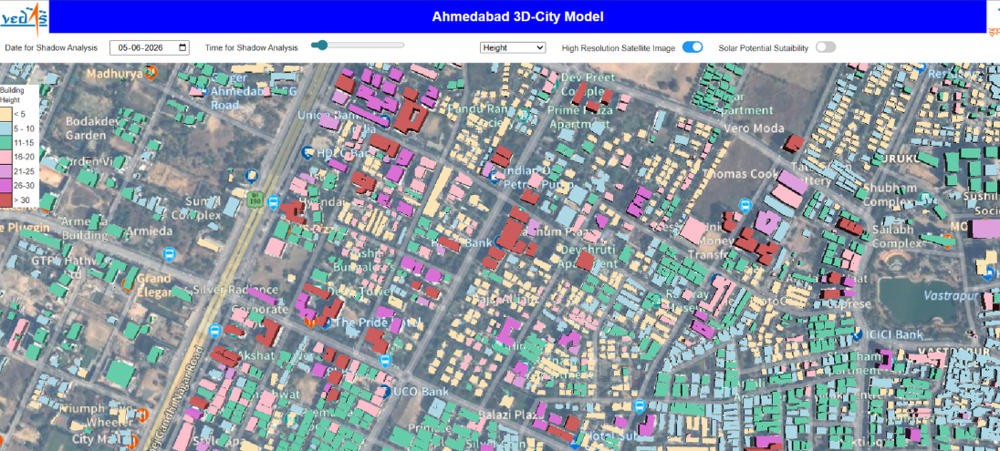

The Ahmedabad 3D City Model was explored as an alternative source for estimating building heights.

Although accurate, extracting heights manually for thousands of buildings was not practical.

Therefore, the study focused on regions where OpenStreetMap already provided reliable building level information.

The final study locations selected were:

- Navrangpura
- Thaltej
- Chandkheda
- Vastrapur

---

# 8. Building Size Classification

To support future benchmark assignment and visualization, residential buildings were classified into three size categories based on total floor area.

- 🟢 Small
- 🟡 Medium
- 🔴 Large

### Navrangpura

### Thaltej

---

# 9. Weather Dataset Preparation

Weather data is an essential input for CityBES energy simulations.

Several weather data sources were explored before selecting an appropriate Typical Meteorological Year (TMYx) dataset for Ahmedabad.

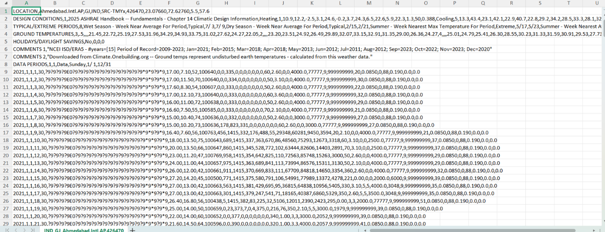

The selected dataset represents weather observations from **2009–2023**, providing a recent climatic profile suitable for baseline building energy simulations.

---

## 10. Python-Based Dataset Enhancement

The exported GeoJSON datasets contained only the geometric and basic building attributes required by CityBES. However, to accurately represent Ahmedabad residential buildings, additional operational parameters had to be incorporated into every building feature.

Manually editing thousands of building records was impractical and error-prone. Therefore, a Python automation script was developed to append the required `additional_json` object to each building in the GeoJSON dataset.

The script automatically iterates through every building feature and inserts Ahmedabad-specific operational parameters while preserving the original geometry and attributes.

### Parameters Added

| Parameter | Purpose |
|-----------|---------|
| HVAC System Type | Specifies the cooling system used in simulations |
| Cooling COP | Defines cooling system efficiency |
| Cooling Thermostat Setpoint | Indoor cooling temperature |
| Heating Thermostat Setpoint | Default heating setpoint |
| Cooling Schedule | Daily cooling operation schedule |
| Heating Schedule | Daily heating schedule |
| Window U-value | Thermal transmittance of glazing |
| Window SHGC | Solar Heat Gain Coefficient |

Only the required parameters were customized, while all remaining operational parameters retained the default CityBES prototype values.

### Advantages

- Eliminated repetitive manual editing
- Ensured consistency across all buildings
- Reduced the possibility of human error
- Generated simulation-ready datasets for EnergyPlus
- Simplified future modifications of operational parameters

### Python Script for Dataset Enhancement

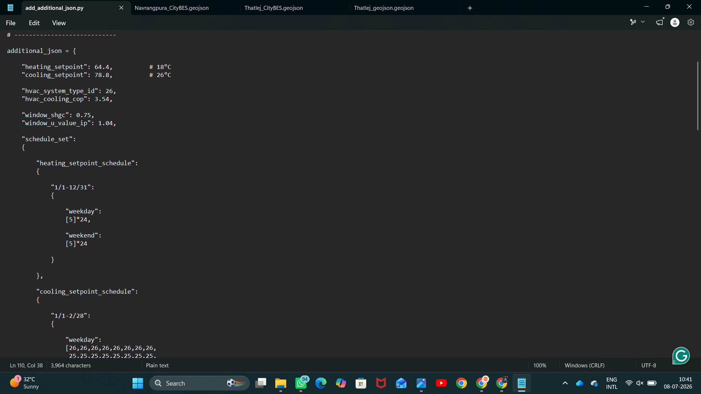

 

*Python script developed to automatically append Ahmedabad-specific `additional_json` parameters.*

---

### Updated GeoJSON Dataset

*GeoJSON dataset after integrating the `additional_json` object into every building feature.*

# 11. EnergyPlus Simulation Workflow

After validating the prepared GeoJSON datasets and ensuring compatibility with the CityBES data requirements, the simulation workflow was continued using **EnergyPlus** for annual building energy analysis.

The validated building models were configured with the selected **Ahmedabad Typical Meteorological Year (TMYx)** weather file and simulated under baseline operating conditions to establish the existing energy performance of the residential buildings.

Subsequently, retrofit models were prepared by modifying the required building and system parameters. These models were simulated under the same climatic conditions to enable a direct comparison with the baseline case.

---

## Simulation Inputs

The EnergyPlus simulations were performed using the following inputs:

| Parameter | Description |
|-----------|-------------|
| Simulation Engine | EnergyPlus 26.1.0 |
| Weather File | Ahmedabad Intl. AP (SRC-TMYx) |
| Simulation Type | Annual (8760 hours) |
| Building Type | Residential Buildings |
| Study Areas | Navrangpura and Thaltej |
| Simulation Cases | Baseline and Retrofit |

---

## Performance Indicators

The simulation results were evaluated using the following performance indicators:

- Annual Site Energy
- Annual Source Energy
- Energy Use Intensity (EUI)
- End-use Electricity Consumption
- Cooling Energy Demand
- Operational Carbon Emissions

The results obtained from the baseline and retrofit simulations are presented in the following sections.

OpenStreetMap
      ↓
QGIS Processing
      ↓
GeoJSON Generation
      ↓
Python Dataset Enhancement
      ↓
Dataset Validation
      ↓
EnergyPlus Simulation
      ↓
Baseline Results
      ↓
Retrofit Simulation
      ↓
Performance Comparison

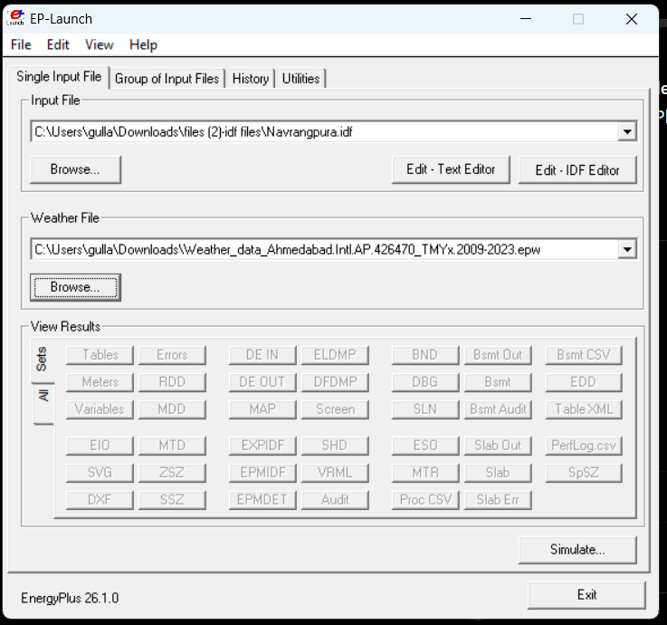

*Figure 11.1: EnergyPlus input model (IDF) together with the selected Ahmedabad EPW weather file.*

# 12. Baseline Energy Simulation Results

Annual baseline simulations were performed in **EnergyPlus** to evaluate the existing energy performance of the residential building stock before implementing any retrofit measures.

The baseline models represent the existing construction characteristics, glazing systems, HVAC configuration, and operational schedules of residential buildings in Ahmedabad. These simulations establish the reference case against which the effectiveness of the proposed retrofit strategies is evaluated.

Two residential districts were analyzed:

- **Navrangpura**
- **Thaltej**

## 12.1 Navrangpura District

| Parameter           | Value         |
| ------------------- | ------------- |
| Total Building Area | 825269.59 m²  |
| Conditioned Area    | 412634.79 m²  |
| Total Site Energy   | 429048.28 GJ  |
| Total Source Energy | 1358795.89 GJ |
| Site EUI            | 519.89 MJ/m²  |
| Source EUI          | 1646.49 MJ/m² |

| End Use            | Energy (GJ) |
| ------------------ | ----------: |
| Cooling            |   139588.60 |
| Interior Lighting  |   156154.21 |
| Interior Equipment |   130128.51 |
| Fans               |     3176.96 |
| Heating            |           0 |

*Figure 12.1: Annual end-use energy distribution for the Navrangpura baseline model.*

### Key Observations

- Interior lighting accounts for the largest share of annual electricity consumption.
- Cooling represents the second-largest energy consumer due to Ahmedabad's hot climate.
- Interior equipment contributes significantly to the total annual energy demand.
- Heating energy is negligible because residential buildings rarely require space heating.
- The baseline model establishes the reference energy performance for subsequent retrofit analysis.

## 12.2 Thaltej District

| Parameter           |         Value |
| ------------------- | ------------: |
| Total Building Area | 1191137.13 m² |
| Conditioned Area    |  595568.57 m² |
| Total Site Energy   |  651649.56 GJ |
| Total Source Energy | 2063774.14 GJ |
| Site EUI            |  547.08 MJ/m² |
| Source EUI          | 1732.61 MJ/m² |

| End Use            | Energy (GJ) |
| ------------------ | ----------: |
| Cooling            |   233170.63 |
| Interior Lighting  |   225382.20 |
| Interior Equipment |   187818.50 |
| Fans               |     5278.22 |
| Heating            |           0 |

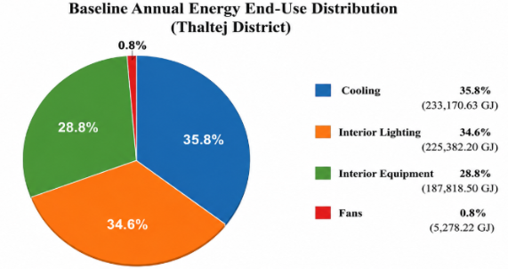

*Figure 12.2: Annual end-use energy distribution for the Thaltej baseline model.*

- Cooling is the dominant end-use because of the larger residential building stock.
- Interior lighting and equipment contribute substantially to annual electricity consumption.
- Heating demand is insignificant under Ahmedabad's climatic conditions.
- Thaltej consumes more total energy than Navrangpura due to its greater built-up area.

## Overall Analysis

The baseline simulations indicate that **cooling, interior lighting, and interior equipment** dominate the annual electricity consumption of residential buildings in both study areas.
Although Thaltej exhibits higher total energy consumption than Navrangpura, this is primarily attributed to its larger building stock and conditioned floor area. When normalized using Energy Use Intensity (EUI), both districts demonstrate comparable energy performance.
These observations highlight that improving the thermal performance of the building envelope and increasing cooling system efficiency offer the greatest potential for reducing annual energy consumption in Ahmedabad's residential sector.

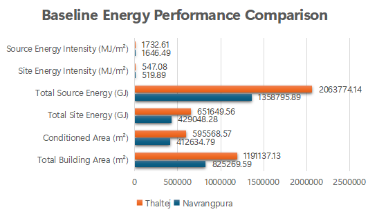

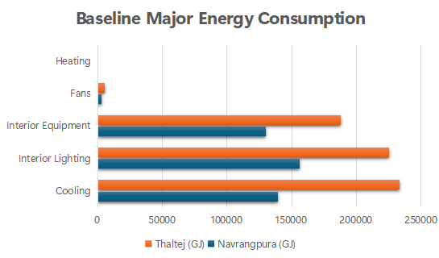

 

# 13. Retrofit Strategy

After evaluating the baseline energy performance of the residential buildings, a retrofit strategy was developed to improve overall energy efficiency while remaining practical for existing buildings.

The retrofit focused on improving the thermal performance of the building envelope and increasing the efficiency of building systems. The selected measures were implemented in the EnergyPlus simulation models and compared with the baseline case to quantify their impact on annual energy consumption.

## 13.1 Selected Energy Conservation Measures (ECMs)

The following Energy Conservation Measures (ECMs) were incorporated into the retrofit model.

| Category | Baseline | Retrofit |
|----------|----------|----------|
| Wall Construction | Masonry Wall | Masonry + PUF Insulation |
| Roof Construction | RCC Roof | RCC + PUF Insulation |
| Window System | Single Glazing | Vacuum Insulated Glazing (VIG) |
| Cooling System | COP = 3.8 | COP = 4.5 |
| Lighting Power Density | 6 W/m² | 5 W/m² |

## 13.2 Why Polyurethane Foam (PUF)?

Polyurethane Foam (PUF) insulation was selected because of its excellent thermal performance and suitability for retrofitting existing buildings.

### Advantages

- Very low thermal conductivity (0.024 W/m·K)
- Excellent thermal insulation performance
- Lightweight construction
- Low moisture absorption
- Easy installation on existing buildings
- Suitable for hot climatic conditions
- Long service life

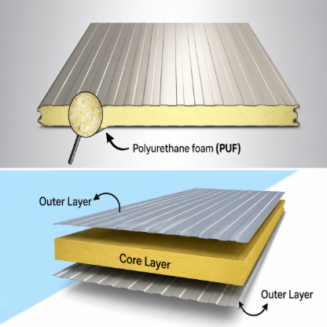

*Figure 13.2: Polyurethane Foam (PUF) insulation used for the retrofit strategy.*

## 13.3 External Insulation

External insulation was adopted to create a continuous thermal envelope around the building.

Compared with internal insulation, external insulation offers several advantages:

- Minimizes thermal bridges
- Preserves indoor floor area
- Causes minimal disturbance to occupants
- Improves overall thermal performance
- Suitable for retrofit applications

## 13.4 Thermal Performance Improvement

The retrofit significantly reduced the thermal transmittance (U-value) of the building envelope.

| Construction | Baseline U-value | Retrofit U-value |
|--------------|----------------:|----------------:|
| Wall | 1.27 W/m²·K | 0.30 W/m²·K |
| Roof | 1.14 W/m²·K | 0.28 W/m²·K |
| Window | 5.905 W/m²·K | 0.60 W/m²·K |

Lower U-values indicate reduced heat transfer through the building envelope, resulting in lower cooling demand during hot weather.

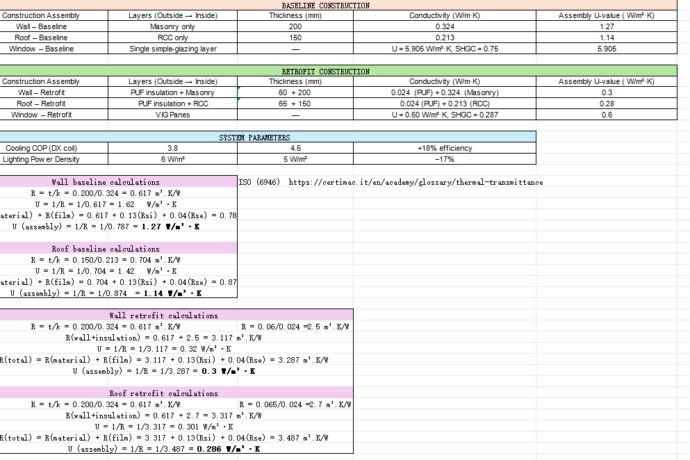

*Figure 13.3: Comparison of baseline and retrofit thermal transmittance values.*

## 13.5 Construction Assemblies

The baseline and retrofit construction assemblies used in the EnergyPlus simulations are summarized below.

| Building Component | Baseline | Retrofit |
|--------------------|----------|----------|
| Wall | Masonry | Masonry + PUF |
| Roof | RCC | RCC + PUF |
| Window | Single Glazing | Vacuum Insulated Glazing |

The selected retrofit measures improve the thermal resistance of the building envelope and reduce unwanted heat transfer into the building. These modifications were incorporated into the EnergyPlus models to evaluate their impact on annual energy consumption under Ahmedabad's climatic conditions.

# 14. Retrofit Simulation Results

After implementing the selected retrofit measures, annual EnergyPlus simulations were performed for both residential districts under identical climatic conditions. The retrofit models were evaluated using the same weather file and operating schedules as the baseline models to ensure a fair comparison.

The simulation results demonstrate the improvements achieved in overall building energy performance after implementing the retrofit strategy.

## 14.1 Navrangpura District

The retrofit simulation for Navrangpura produced significant improvements in annual energy performance.

### Annual Energy Performance

| Parameter               |         Value |
| ----------------------- | ------------: |
| Total Building Area     |  825269.59 m² |
| Conditioned Area        |  412634.79 m² |
| Total Site Energy       |  359939.78 GJ |
| Site Energy Intensity   |  436.15 MJ/m² |
| Total Source Energy     | 1139929.29 GJ |
| Source Energy Intensity | 1381.28 MJ/m² |

| End Use            | Energy (GJ) |
| ------------------ | ----------: |
| Cooling            |    97069.89 |
| Interior Lighting  |   130128.51 |
| Interior Equipment |   130128.51 |
| Fans               |     2612.87 |

### Performance Analysis

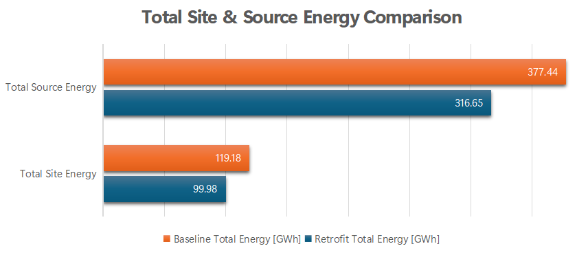

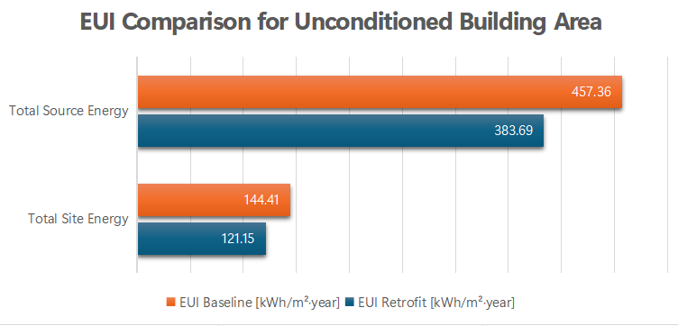

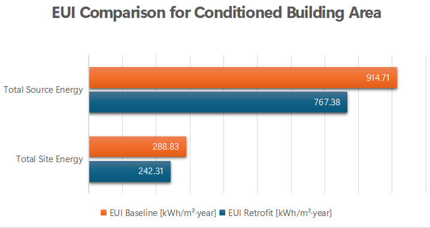

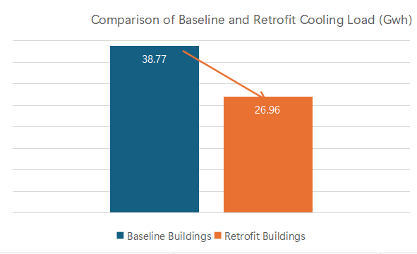

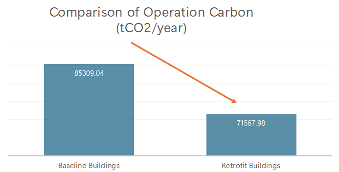

### Key Observations

- Significant reduction in annual site and source energy.
- Cooling energy demand decreased substantially.
- Lower Energy Use Intensity indicates improved building performance.
- Operational carbon emissions decreased due to lower electricity consumption.

## 14.2 Thaltej District

The retrofit simulation for Thaltej produced significant improvements in annual energy performance.

| Parameter           |         Value |
| ------------------- | ------------: |
| Total Building Area | 1191137.13 m² |
| Conditioned Area    |  595568.57 m² |
| Total Site Energy   |  537968.87 GJ |
| Site EUI            |  451.64 MJ/m² |
| Total Source Energy | 1703747.42 GJ |
| Source EUI          | 1430.35 MJ/m² |

| End Use            | Energy (GJ) |
| ------------------ | ----------: |
| Cooling            |   158091.95 |
| Interior Lighting  |   187818.50 |
| Interior Equipment |   187818.50 |
| Fans               |     4239.92 |

### Performance Analysis

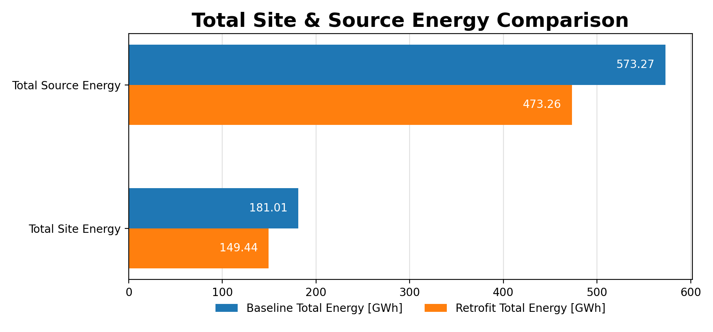

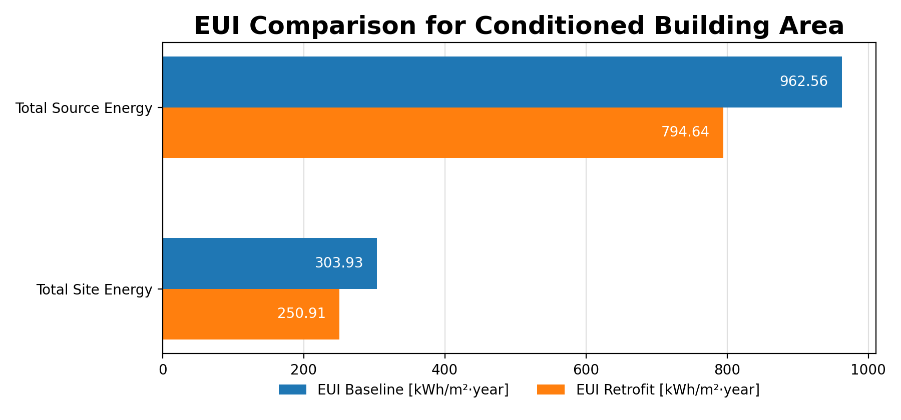

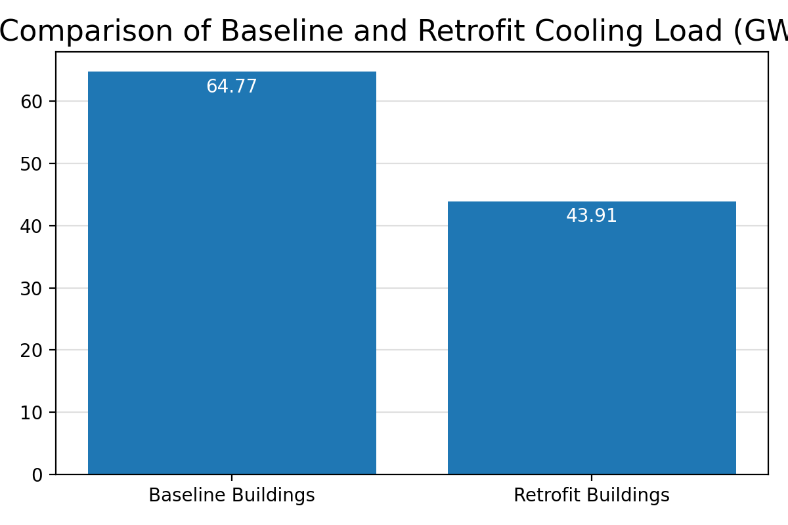

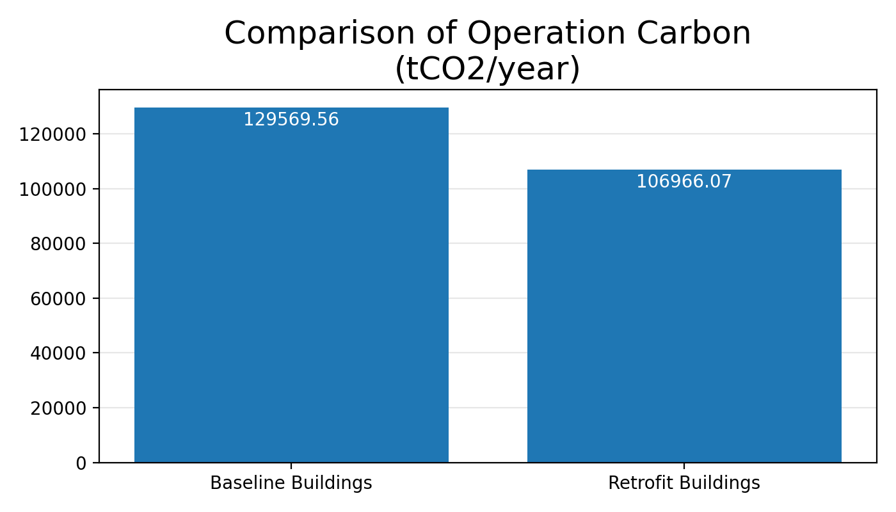

### Key Observations

- Retrofit measures significantly improved overall energy performance.
- Cooling energy showed the highest reduction among all end uses.
- Lower site and source energy demonstrate improved efficiency.
- Reduced operational carbon emissions highlight the environmental benefits of the retrofit strategy.

## Overall Analysis

The retrofit simulations demonstrate that improvements to the building envelope and building systems significantly reduce annual energy consumption for residential buildings in Ahmedabad.

Both Navrangpura and Thaltej exhibited lower site energy, source energy, Energy Use Intensity (EUI), cooling demand, and operational carbon emissions after retrofit implementation. These improvements confirm the effectiveness of the proposed retrofit strategy under Ahmedabad's hot climatic conditions.

The detailed quantitative comparison between the baseline and retrofit models is presented in the following section.

# 15. Baseline vs Retrofit Performance Comparison

To quantify the effectiveness of the proposed retrofit strategy, the baseline and retrofit simulation results were compared for both residential districts. The comparison includes annual energy consumption, Energy Use Intensity (EUI), cooling demand, and operational carbon emissions.

The percentage reduction for each parameter was calculated using:

Reduction (%) = ((Baseline − Retrofit) / Baseline) × 100

## 15.1 Navrangpura District

| Parameter                       |   Baseline |   Retrofit |  Reduction |
| ------------------------------- | ---------: | ---------: | ---------: |
| Total Site Energy (GJ)          |  429048.28 |  359939.78 | **16.11%** |
| Total Source Energy (GJ)        | 1358795.89 | 1139929.29 | **16.11%** |
| Site Energy Intensity (MJ/m²)   |     519.89 |     436.15 | **16.11%** |
| Source Energy Intensity (MJ/m²) |    1646.49 |    1381.28 | **16.11%** |
| Cooling Energy (GJ)             |  139588.60 |   97069.89 | **30.46%** |
| Interior Lighting (GJ)          |  156154.21 |  130128.51 | **16.67%** |
| Interior Equipment (GJ)         |  130128.51 |  130128.51 |     **0%** |
| Fan Energy (GJ)                 |    3176.96 |    2612.87 | **17.75%** |

### Summary

The retrofit strategy reduced annual site energy consumption by approximately **16.1%**, while cooling energy demand decreased by more than **30%**. Lower Energy Use Intensity (EUI) and operational carbon emissions demonstrate the effectiveness of improving the building envelope and cooling system efficiency for Ahmedabad's residential buildings.

## 15.2 Thaltej District

| Parameter                       |   Baseline |   Retrofit |  Reduction |
| ------------------------------- | ---------: | ---------: | ---------: |
| Total Site Energy (GJ)          |  651649.56 |  537968.87 | **17.44%** |
| Total Source Energy (GJ)        | 2063774.14 | 1703747.42 | **17.44%** |
| Site Energy Intensity (MJ/m²)   |     547.08 |     451.64 | **17.44%** |
| Source Energy Intensity (MJ/m²) |    1732.61 |    1430.35 | **17.44%** |
| Cooling Energy (GJ)             |  233170.63 |  158091.95 | **32.20%** |
| Interior Lighting (GJ)          |  225382.20 |  187818.50 | **16.67%** |
| Interior Equipment (GJ)         |  187818.50 |  187818.50 |     **0%** |
| Fan Energy (GJ)                 |    5278.22 |    4239.92 | **19.67%** |

### Summary

The retrofit strategy achieved an overall reduction of approximately **17.4%** in annual site energy consumption. Cooling energy demand exhibited the largest improvement, decreasing by more than **32%**, while reductions in Energy Use Intensity (EUI) and operational carbon emissions further demonstrate the effectiveness of the proposed retrofit measures.

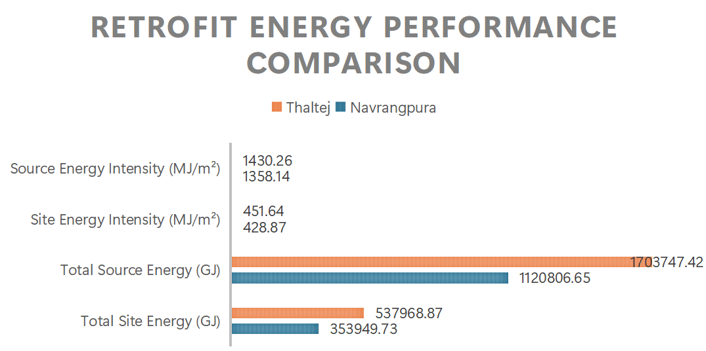

 

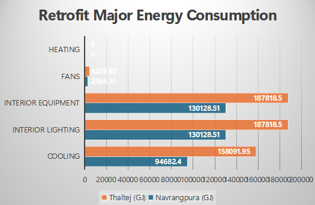

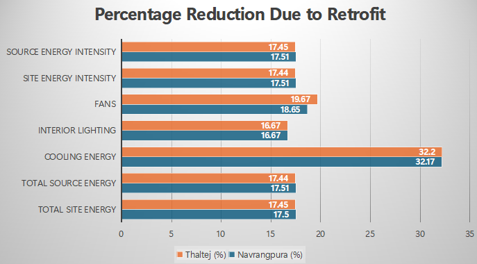

 

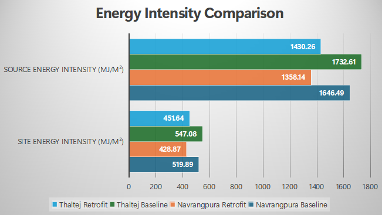

  

## Overall Findings

The comparative analysis demonstrates that the proposed retrofit strategy substantially improves the energy performance of residential buildings in both study areas.

### Key Findings

- Annual site energy reduced by **16.11%** in Navrangpura and **17.44%** in Thaltej.

- Cooling energy demand decreased by **30.46%** and **32.20%**, respectively.
- Energy Use Intensity (EUI) was reduced for both total and conditioned building areas.
- Operational carbon emissions decreased proportionally with the reduction in electricity consumption.
- Interior equipment energy remained unchanged because equipment schedules and loads were not modified during the retrofit simulations.
- The results confirm that improvements to the building envelope and cooling system are highly effective for Ahmedabad's cooling-dominated climate.

# 16. Tools and Technologies Used

The project involved the integration of Geographic Information Systems (GIS), building energy simulation software, programming tools, and open geospatial datasets to develop a complete Urban Building Energy Modeling (UBEM) workflow.

| Category | Tool / Technology | Purpose |
|----------|-------------------|---------|
| GIS Software | QGIS | Spatial data processing, visualization, and attribute generation |
| Geospatial Data | OpenStreetMap (QuickOSM) | Building footprint extraction |
| Building Height Estimation | Google Earth Pro | Building height validation |
| Additional Data Sources | VEDAS, Bhuvan, Ahmedabad 3D City Model, Copernicus Browser | Building geometry and satellite data |
| Programming Language | Python | GeoJSON automation and dataset enhancement |
| Data Format | GeoJSON | CityBES-compatible building dataset |
| Building Energy Simulation | EnergyPlus 26.1.0 | Annual building energy simulations |
| Weather Data | Climate.OneBuilding (TMYx) | Ahmedabad weather file (EPW) |
| Spreadsheet Software | Microsoft Excel | Data analysis and graph generation |
| Documentation | LaTeX (Overleaf) | Technical report preparation |
| Version Control | Git & GitHub | Project documentation and source code management |

# 17. Challenges Faced

During the development of the project, several practical challenges were encountered while preparing the datasets and performing large-scale building energy simulations.

### Challenge 1 — Incomplete Building Attributes

OpenStreetMap datasets did not contain complete information such as building heights, construction year, and number of storeys for many residential buildings.

**Solution:** Building heights were estimated using Google Earth Pro, Ahmedabad 3D City Model, satellite imagery, and engineering assumptions.

---

### Challenge 2 — GeoJSON Compatibility

The exported GeoJSON files required modifications before they could be used for building energy simulations.

**Solution:** Python scripts were developed to automatically append Ahmedabad-specific operational parameters using the `additional_json` object.

---

### Challenge 3 — Simulation Input Preparation

Preparing simulation-ready building models required careful verification of geometry, mandatory attributes, weather files, HVAC parameters, schedules, and construction properties.

**Solution:** Multiple validation steps were performed before executing the EnergyPlus simulations.

---

### Challenge 4 — Computational Time

Annual EnergyPlus simulations for large urban building datasets required significant computational resources and execution time.

- Baseline Simulation (Navrangpura): **~20 hours**
- Baseline Simulation (Thaltej): **~20 hours**
- Retrofit Simulation (Navrangpura): **~6 hours**
- Retrofit Simulation (Thaltej): **~8 hours**

Despite the long simulation times, the generated outputs enabled a comprehensive comparison between baseline and retrofit building energy performance.

# 18. Future Scope

The developed workflow provides a strong foundation for extending Urban Building Energy Modeling to larger regions and more advanced applications.

Possible future enhancements include:

- Extend the workflow to cover the entire Ahmedabad city.
- Include commercial, institutional, and mixed-use buildings.
- Evaluate additional Energy Conservation Measures (ECMs).
- Perform life-cycle cost and economic feasibility analysis.
- Integrate renewable energy systems such as rooftop solar PV.
- Develop AI/Machine Learning models for automated retrofit recommendations.
- Build an interactive GIS dashboard for visualization and decision support.
- Validate simulation results using measured building energy consumption data.
- Automate the complete GIS-to-EnergyPlus workflow for large-scale urban analysis.
- Apply the methodology to other Indian cities for comparative energy assessments.

